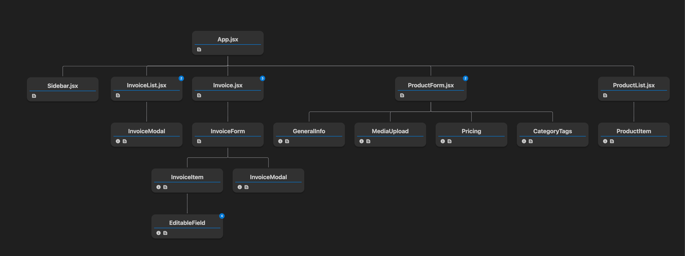

# Product Tab and Invoice Integration

1. **Product Tab Features:**
    - A Redux store is used to manage the product list.
    - Products can be filtered by name or description.
    - Currency can be converted from the base currency (the one the item is created with) to a target currency.

2. **Product Form:**
    - Supports uploading up to 3 images.
    - All fields in the product form are important and required.
    - Checks for existing items by name, but it’s better to check by product ID.

3. **Automatic Product Population:**
    - If a product already exists when trying to create it, the form will automatically populate with the existing details.
    - If the product is updated, the original product details will also be updated.

4. **Invoice and Product Integration:**
    - When adding a new item or product to the invoice, the original product’s details and currency are modified.
    - The invoice form checks if the product exists in the product list:
      - If the product exists, the invoice form is updated with the existing product details.
      - New and old item IDs are stored in an array so that the product can be queried using the item ID.
      - When a product is changed, it will be reflected wherever the item is used.
    - I didn’t modify the previous implementation of the invoice form, which stores actual item details. I only added an item ID so that product changes affect the invoice where the item is used.

5. **Currency States:**
    - **Local Currency State:** Used only when creating an invoice or product. This can be changed only in the invoice or product form.
    - **Global Currency State:** Used for converting any amount to the target currency. The local currency state won’t work for global conversions to prevent conflicts and confusion.


  

# Tools I Used

* Continue VS Code Extension
* Open Web UI for documentation search
* ClaudeAI for converting images(Design) to UI
* ChatGPT (used occasionally)


# My Learning Curve and Development Process

* **Previous Experience:**
  * Before this project, I hadn’t worked  with Bootstrap. My experience was primarily with React, Tailwind, and TypeScript.

* **Converting Images to Code:**
  * The process of converting images to code took me around 30-50 minutes.

* **Integrating Redux and Store Management:**
  * I spent about 2 hours integrating Redux and managing the store logic, making sure to handle all possible edge cases that could occur.

* **Documentation and Video Editing:**
  * I spent around 2 hours on documentation, video recording, and editing.

* **Other Tasks:**
  * The entire development process took about 8-12 hours in total, with most of the time spent solving problems, refining the logic, and thinking through better solutions as I progressed.


## Component Tree
<div align="center">
  
</div>


## Folder Structure

```bash
|-- swipe-assignment-frontend
    |-- public
        |-- favicon.ico
        |-- index.html
        |-- manifest.json
        |-- robots.txt
    |-- .gitignore
    |-- package-lock.json
    |-- package.json
    |-- src
        |-- favicon-16x16.png
        |-- favicon.ico
        |-- index.html
        |-- reportWebVitals.js
        |-- store.js
        |-- App.css
        |-- index.js
        |-- utils
            |-- generateRandomId.js
        |-- index.css
        |-- components
            |-- InvoiceModal.jsx
            |-- EditableField.jsx
            |-- product
                |-- ProductForm.jsx
                |-- MediaUpload.jsx
                |-- ProductItem.jsx
                |-- CategoryTags.jsx
                |-- GeneralInfo.jsx
                |-- Pricing.jsx
            |-- Sidebar.jsx
            |-- InvoiceForm.jsx
            |-- InvoiceItem.jsx
        |-- pages
            |-- Invoice.jsx
            |-- InvoiceList.jsx
            |-- ProductList.jsx
        |-- redux
            |-- currenciesSlice.js
            |-- invoicesSlice.js
            |-- hooks.js
            |-- index.js
            |-- productsSlice.js
        |-- App.js
        |-- favicon-32x32.png
|-- test.py
|-- package-lock.json
|-- package.json

```

<h2>My Extension</h2>
<p>
  Orian (Ollama WebUI) is a Chrome extension that provides quick access to your favorite local Language Model (LLM) directly from your browser. With features like open-source chat integration, mail reply suggestions, and more, it's designed to enhance your browsing experience with AI capabilities.
</p>
<p>Here are the working demos:</p>

[Email](https://github.com/user-attachments/assets/a714bbe3-a146-4e7f-b096-da210b653383)

<p>Latest version of my extension has better features.</p>


